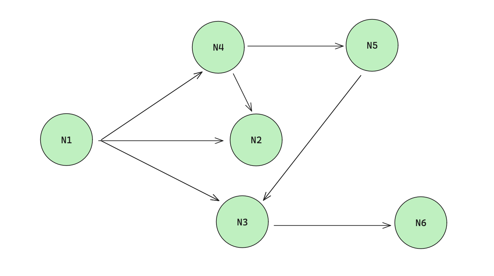

  <h1>Project Octopus</h1>
  <h3>TentacleWeb</h3>
  <image style="display: block; margin-left: auto; margin-right: auto; width: 10%; border-radius: 10%;" src="images/octopus.png"/>
  <h5>Team Indigo Sword</h5>
  <h6>2024</h6>

#### What is TentacleWeb?

- TentacleWeb is the server-side code for Project Octopus. It is implemented in Python, using the Flask - SQLAlchemy framework. It is made basically of API, class codes and unit tests.
- The 3 basic pillars of TentacleWeb are the **Node**, **Path** and **User** classes, which are used sava data in a database.
- **Node:** A class that represents a **level** in the game. It contains the level's data, such as its name, description, and its function to get its level.
- **Path:** A sequence of **Nodes** which comprise a possible **gameplay path** for the game.
- **User:** A class that represents a user in the game. It contains the user's data, such as its name, email, and password.
- You can perform a series of actions on them, which will be interfaced through the **client**.

#### What does that look like?

- We can see different **Paths**: N1 - N2, N1 - N4 - N2, etc.
- Each **Path** is made of different **Nodes**.

#### Interacting with the classes

- The only way to interact with the classes is through the **API**. It is made of **endpoints** that can be accessed through **HTTP** requests.
- Here we will document each endpoint of the API with its methods and parameters. Have in mind that when we write the name of a parameter in [brackets], it means that it is optional.
- **User related endpoints**:

  | Endpoint         | Method | Parameters                       | Description                                | Needs Login? |
  | ---------------- | ------ | -------------------------------- | ------------------------------------------ | ------------ |
  | /login           | POST   | username, password               | Log into the API.                          | no           |
  | /logout          | POST   | username                         | Log out of the API.                        | yes          |
  | /create_user     | POST   | username, email, password, [bio] | Create a new user.                         | no           |
  | /get_user        | GET    | username                         | Get user's data.                           | no           |
  | /change_user_bio | POST   | username, bio                    | Change user's bio.                         | yes          |
  | /follow_user     | POST   | username, followed_username      | Follow a user.                             | yes          |
  | /unfollow_user   | POST   | username, unfollowed_username    | Unfollow a user.                           | yes          |
  | /get_follows     | GET    | username                         | Get user's followers and who user follows. | no           |
  | /add_friend      | POST   | username, friend_username        | Add a friend.                              | yes          |
  | /accept_friend   | POST   | username, friend_username        | Accept a friend request.                   | yes          |
  | /reject_friend   | POST   | username, friend_username        | Reject a friend request.                   | yes          |
  | /remove_friend   | POST   | username, friend_username        | Remove a friend.                           | yes          |
  | /get_friends     | GET    | username                         | Get user's friends.                        | no           |

- **Node related endpoints**:

  | Endpoint                 | Method | Parameters                                                     | Description          | Needs Login? |
  | ------------------------ | ------ | -------------------------------------------------------------- | -------------------- | ------------ |
  | /create_node\*           | POST   | username, description, title, file/\* [is_initial], [is_final] | Create a new node.   | yes          |
  | /get_level               | GET    | node_id                                                        | Get node's level.    | no           |
  | /update_node_level\*     | POST   | username, node_id, file\*                                      | Update node's level. | yes          |
  | /get_node                | GET    | node_id                                                        | Get node's data.     | no           |
  | /link_nodes              | POST   | username, origin_id, destination_id                            | Link two nodes.      | yes          |
  | /get_next_links          | GET    | node_id                                                        | Get next nodes.      | no           |
  | /get_previous_links      | GET    | node_id                                                        | Get previous nodes.  | no           |
  | /update_playcount        | POST   | node_id                                                        | Update playcount.    | no           |
  | /update_rating           | POST   | username, node_id, rating                                      | Update rating.       | yes          |
  | /update_node_description | POST   | username, node_id, description                                 | Update description.  | yes          |
  | /update_node_title       | POST   | username, node_id, title                                       | Update title.        | yes          |

  *: This endpoint needs to have also a file uploaded with the node's level. The name of the file does not matter. It should be in the request's *files* attribute under the key *file\*.

- **Path related endpoints**:

  | Endpoint                 | Method | Parameters                                            | Description                   | Needs Login? |
  | ------------------------ | ------ | ----------------------------------------------------- | ----------------------------- | ------------ |
  | /create_path             | POST   | username, description, title,                         | Create a new node.            | yes          |
  | /add_to_path             | POST   | username, path_id, node_id, position                  | Add node to path.             | yes          |
  | /get_path                | GET    | path_id                                               | Get path's data.              | no           |
  | /create_path_from_nodes  | POST   | username, title, description, node_ids\*, positions\* | Create a new path from nodes. | yes          |
  | /update_path_playcount   | POST   | path_id                                               | Update playcount.             | no           |
  | /update_path_rating      | POST   | username, path_id, rating                             | Update rating.                | yes          |
  | /update_path_description | POST   | username, path_id, description                        | Update description.           | yes          |
  | /update_path_title       | POST   | username, path_id, title                              | Update title.                 | yes          |
  | /get_user_paths          | GET    | username                                              | Get user's paths.             | no           |
  | /get_node_paths          | GET    | node_id                                               | Get node's paths.             | no           |

\*: This variable needs to be a list. It should be in the request's _form_ attribute under the key *node_ids\* or *positions\*.
