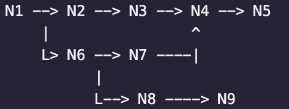

Ok, so what we want to have is a sequence of nodes like this:

Where path N1 N2 N3 N4 N5 will be path #1, path N1 N6 N7 N4 N5 will be path #2,
and path N1 N6 N8 N9 will be path #3.

The link between each node should have a description put by the creator

We should save the path names, alongside their owner / creator, description, in some kind of database.
-- Where are we going to save the paths and levels??

To create new path IDs, we should go through a centralized queue that will receive them. We don't want just to create
the IDs instantly to avoid paths with same name.

We do need:

- a level database. Somehow store the level somewhere, store its node id there.
- a node database. Store node id, and its info. Should not be hard.
